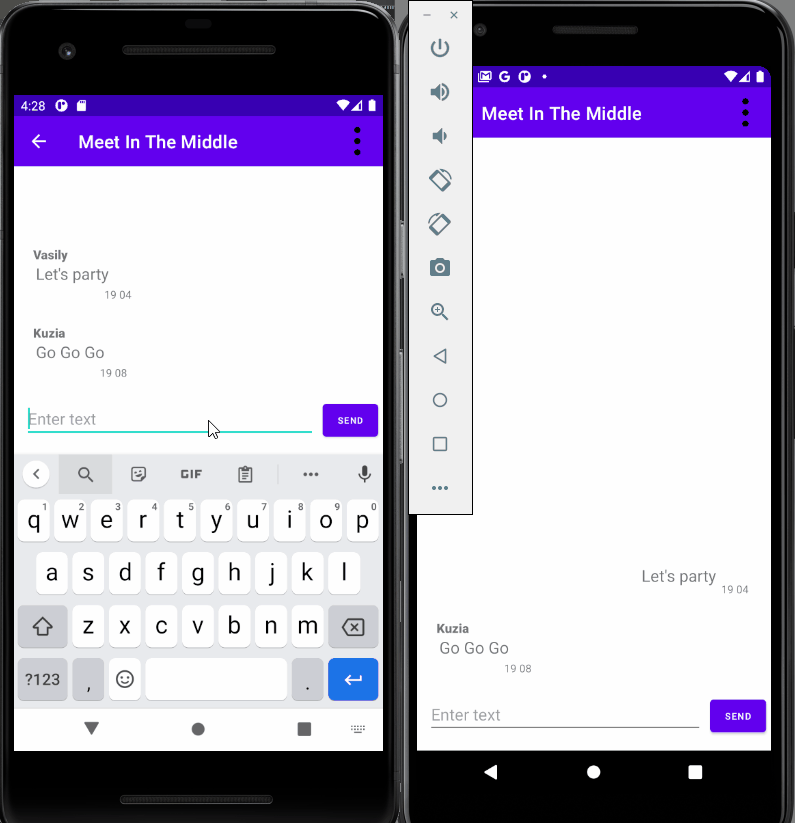
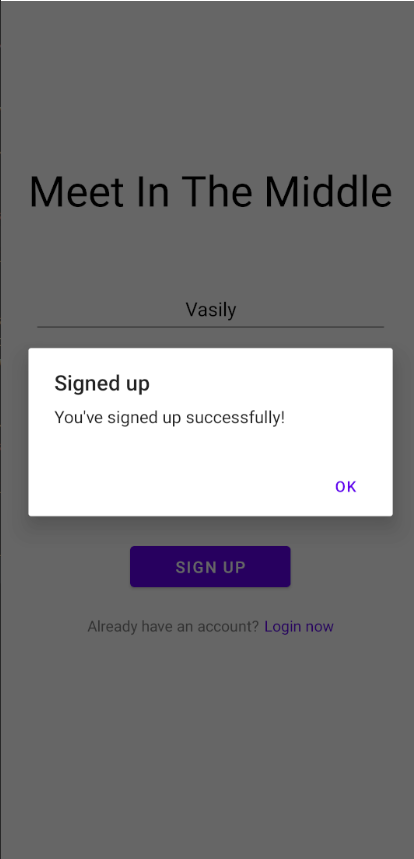
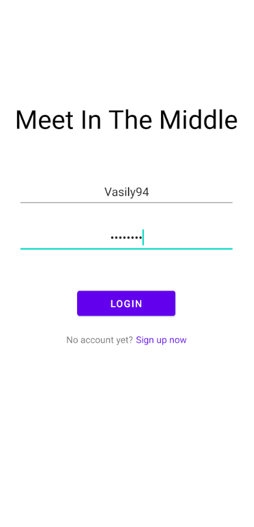
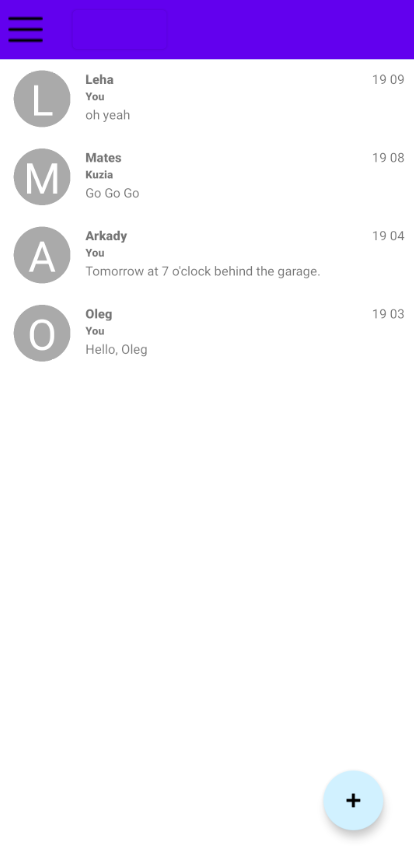
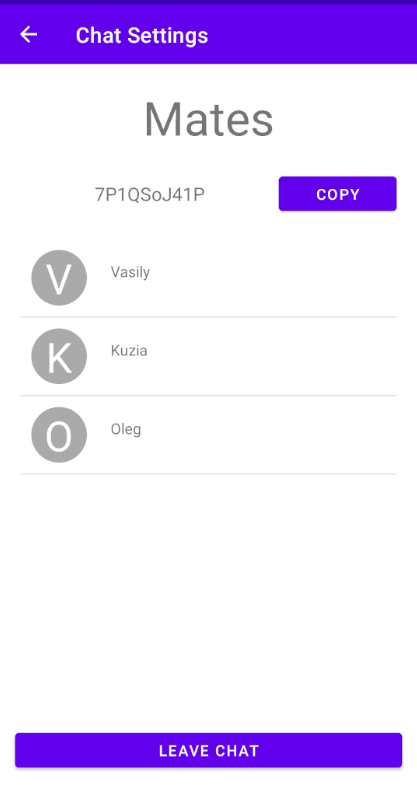

# Meet in the Middle project
## BSU FAMCS 2020
### Educational project in Java and Web.

This repo contains MiM (Meet in the Middle) messenger application. It allows users to create chats, invite others into chats and message each other.
It uses HTTP and STOMP (WebSocket) protocols, exchanging messages parsed from JSON format.

okHTTP and ReactiveX were involved to produce efficient queries handling. GUI is implemented using Android Native tools.

MiM Server is located at [https://github.com/VKuzia/mim-server](https://github.com/VKuzia/mim-server).

 

  |  
:-------------------------:|:-------------------------:
 | 

#### The contributors:
* Maxim Kogan [@maxim12321](https://github.com/maxim12321)
* Katerina Pospelova [@kateposp](https://github.com/kateposp)
* Vladislav Buyval [@buyval01](https://github.com/buyval01)
* Vladimir Kuzmitski [@VKuzia](https://github.com/VKuzia)

#### Big thanks to:
* Matvei Nazaruk
* Andrei Golovach

